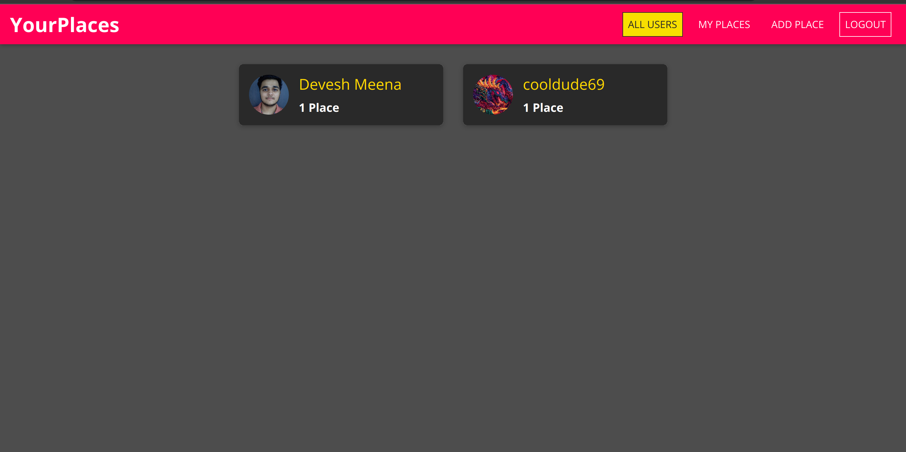
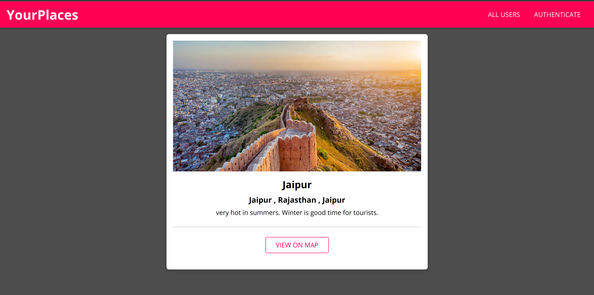
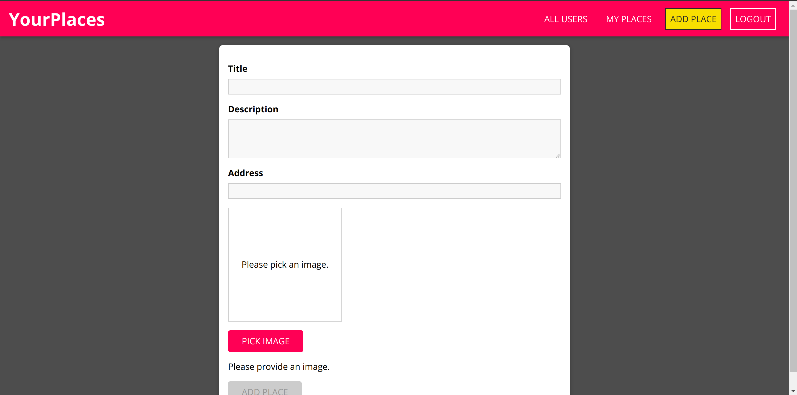

<h1 align="center" style="color:orange;"> Trabel</h1>

 <h2 align="center">Went on a journey? Share it with others on Trabel!</h2>

 

 <h2 align="center"><strong>Share your journey with others!</strong></h2>
 

 <h2 align="center"><strong>Scroll through other's journeys!</strong></h2>
 

 <h2 align="center"><strong>Create new blogs!</strong></h2>
 

## Requirements :

- node: v16.17.0
- docker (optional)

## Run on local machine :

### With Docker :

#### Production Build :

##### Step-1 : build

    make build-production

##### Step-2 : run

    make run-production

#### Development Build :

##### Step-1 : build

    make build-dev

##### Step-2 : run

    make run-dev

### Without Docker :

#### Development Build :

##### Step-1 : build & run client

    make build-client

##### Step-2 : build & run server

    make build-server

### Preview-Links :

#### Client :

- [Dockerized - Production](https://localhost:8080)
- [Dockerized - Development](https://localhost:3000)
- [Without Docker](https://localhost:3000)

#### Server :

- [Server](https://localhost:5000)

LICENSE?   <h3>You dont need one!</h3> 

 
 

if you find any problems feel free to create an issue.
